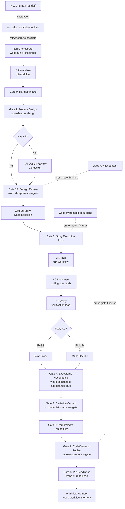

# hermes-ecc-profile

Skill-first coding profile for Hermes — a complete idea-to-delivery pipeline with role-specialized agents, hard gates, and traceable review at every stage.

## Vision

- **Unattended delivery is the long-term vision**: use role-specialized agents and hard gates so more work can run reliably with minimal human intervention.
- **Design principles are the core differentiator**: this profile enforces role separation, deterministic gate progression, and traceable review from idea to merged PR.
- **Baseline-first governance**: default to mainstream, maintainable, evolvable baselines; deviations require ADR + explicit approval.

## Two-Stage Pipeline

```
┌─────────────────────────────────────────────────────────────────┐
│                    Product Design Stage                          │
│                  (skills/product-design/)                        │
│                                                                 │
│  Idea → Capture → Discovery → 🚦 Human Gate → PRD → Handoff   │
│                                                                 │
│  Entry: woos-idea-to-delivery                                   │
│  Modes: Lite / Standard / Strict                                │
└────────────────────────────┬────────────────────────────────────┘
                             │  Build Handoff (file-based contract)
                             ▼
┌─────────────────────────────────────────────────────────────────┐
│                   Software Development Stage                     │
│               (skills/software-development/)                     │
│                                                                 │
│  Design → Stories → TDD Loop → Review → Trace → PR             │
│                                                                 │
│  Entry: woos-development-workflow                                │
│  Modes: Lite / Standard / Strict                                │
└─────────────────────────────────────────────────────────────────┘
```

**Key boundary:** Product defines WHAT/WHY. Engineering decides HOW. The handoff file is the contract between stages.

## Product Design Stage

See [`skills/product-design/README.md`](./skills/product-design/README.md) for full details.

**Skills:**

| Skill | Role |
|-------|------|
| `woos-idea-to-delivery` | Entry point — umbrella orchestrator, tier routing |
| `woos-idea-capture` | Phase 1 — idea interview and structuring |
| `woos-product-discovery` | Phase 2 — research, roadmap, architecture |
| `woos-product-design-flow` | Phase 3 — PRD pipeline orchestrator |
| `woos-ui-design-brief` | UI direction and wireframes |
| `woos-build-handoff` | Handoff packaging |

**Enforcement:** 7 non-negotiable rules (E1–E7) prevent agents from skipping steps, ignoring templates, or doing shallow reviews.

## Software Development Stage

**Entry skill:** `woos-development-workflow` (v2.0.0)



**Execution profiles:**

1. **Lite**: Handoff Intake → Implement → Verify → Code Review → PR
2. **Standard (default)**: Full gate flow with story decomposition, traceability, and DCR
3. **Strict**: Standard + API Design Review + Browser QA + Architecture Conformance

## Feedback Loop (DCR)

When the engineering stage discovers a product assumption is wrong, it issues a **Design Change Request** back to product:

```
Engineering → docs/feedback/<feature>-dcr.md → Product Design → updated handoff → Engineering resumes
```

Available in Standard and Strict modes.

## Install

```bash
cd /path/to/hermes-ecc-profile
python3 install-profile.py
```

The installer will prompt for local ECC repo path.

Optional:

```bash
python3 install-profile.py --ecc-path /path/to/ecc --profile-root ~/.hermes/profiles/coding --install-soul
```

Installed layout (default profile root: `~/.hermes/profiles/coding`):

- `skills/product-design/*` (product workflow skills)
- `skills/software-development/*` (local workflow skills)
- `skills/ecc-import/*` (imported ECC skills)
- `skills/ecc-agent-skills/*` (agent adapters)
- `SOUL.md` (only if `--install-soul`)

## Near-Unattended Execution Foundation

Seven-part foundation for near-unattended delivery:

1. `woos-run-orchestrator` — run queue, concurrency, timeout/retry
2. `woos-executable-acceptance-gate` — machine-checkable done criteria
3. `woos-failure-state-machine` — deterministic retry/degrade/escalation
4. `woos-deviation-control-gate` — implementation-vs-spec drift blocking
5. `woos-workflow-memory` — persistent failure/rework pattern capture
6. `woos-human-handoff` — explicit takeover and recovery protocol
7. `woos-review-context` — cumulative cross-gate findings

## ADR Governance

- ADR template: `docs/adr/ADR-template.md`
- Design/code review gates require: `baseline_compliance_status`, `deviation_detected`, `deviation_adr_path`
- Run finalization requires verified run manifest: `<workspace_root>/.hep/runs/<run_id>/run-manifest.yaml`
