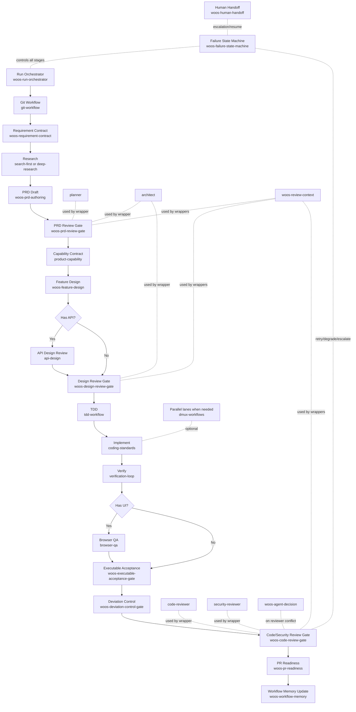

# hermes-ecc-profile

[中文说明 / Chinese README](./README.zh-CN.md)

Skill-first coding profile for Hermes, with:

- local workflow/gate skills (`woos-*`)
- imported ECC skills (`skills/ecc-import/*`)
- agent-adapter skills (`skills/ecc-agent-skills/*`)

## Vision and design highlights

- **Unattended delivery is the long-term vision**: use role-specialized agents and hard gates so more work can run reliably with minimal human intervention.
- **Design principles are the core differentiator**: this profile is not just a skill bundle. It enforces role separation, deterministic gate progression, and traceable review from intent/design to final implementation.
- **Baseline-first governance**: default to mainstream, maintainable, evolvable engineering baselines; deviations require ADR + explicit approval.

## `woos-development-workflow` flowchart



## Workflow profiles

To avoid over-processing small tasks, the workflow supports three execution profiles:

1. **Lite**: `Run Orchestrator -> Git Workflow -> Requirement Contract -> Implement -> Verify -> Code/Security Review -> PR Readiness`
2. **Standard (default)**: adds PRD/design review and workflow memory for normal feature delivery
3. **Strict**: full hard-gate flow (research/capability/TDD/acceptance/deviation + conditional API/Browser QA)

## What this profile installs

1. Local workflow skills:
    - `woos-development-workflow`
    - `woos-requirement-contract`
    - `woos-prd-authoring`
    - `woos-prd-review-gate`
    - `woos-feature-design`
    - `woos-design-review-gate`
    - `woos-executable-acceptance-gate`
    - `woos-failure-state-machine`
    - `woos-deviation-control-gate`
    - `woos-run-orchestrator`
    - `woos-human-handoff`
    - `woos-workflow-memory`
    - `woos-review-context`
    - `woos-agent-decision`
    - `woos-code-review-gate`
    - `woos-pr-readiness`
    - `woos-setup-rules`
2. Imported skills:
   - `git-workflow`
   - `search-first` / `deep-research` (optional upgrade)
   - `dmux-workflows`
   - `product-capability`
   - `tdd-workflow`
   - `coding-standards`
   - `verification-loop`
   - `api-design` (for REST/GraphQL validation)
   - `browser-qa` (for frontend testing)
3. Agent-adapter skills:
   - `planner`
   - `architect`
   - `code-reviewer`
   - `security-reviewer`

## Install

```bash
cd /path/to/hermes-ecc-profile
python3 install-profile.py
```

The installer will prompt for local ECC repo path.

Optional:

```bash
python3 install-profile.py --ecc-path /path/to/ecc --profile-root ~/.hermes/profiles/coding --install-soul
```

Backup options:

```bash
# custom backup path
python3 install-profile.py --backup-dir ~/.hermes/profiles/coding.backup.manual

# skip backup (not recommended)
python3 install-profile.py --no-backup
```

MCP sync options:

```bash
# sync recommended MCP servers into <profile>/config.yaml (default interactive: yes)
python3 install-profile.py --sync-mcp

# skip MCP sync
python3 install-profile.py --no-sync-mcp
```

Rules sync options:

```bash
# sync ECC rule groups into <profile>/rules/ecc-import
python3 install-profile.py --sync-rules

# skip rules sync
python3 install-profile.py --no-sync-rules
```

`./install-profile.sh` remains as a thin wrapper to `python3 install-profile.py`.

Installed layout (default profile root: `~/.hermes/profiles/coding`):

- `skills/software-development/*` (local workflow skills)
- `skills/ecc-import/*` (imported ECC skills)
- `skills/ecc-agent-skills/*` (agent adapters)
- `SOUL.md` (only if `--install-soul`)

By default, if the target profile root already exists and is non-empty, the installer creates a timestamped backup before applying changes.

## MCP sync behavior

When enabled, installer syncs these MCP server configs from ECC `mcp-configs/mcp-servers.json` into `<profile>/config.yaml` under `mcp_servers`:

- `github`
- `context7`
- `exa-web-search`
- `firecrawl`
- `playwright`

Existing `mcp_servers.<name>` entries in profile config are preserved (not overwritten).

## Upgrade flow (ECC changes)

Agent-adapter skills include source tracking fields:

- `ecc_source_repo`
- `ecc_source_path`
- `ecc_source_commit`

When ECC updates, compare the source commit in each adapter skill with current ECC git history. If changed, re-run adapter conversion.

## Rules sync + routing in Hermes

Installer can sync all ECC rule groups into:

- `<profile>/rules/ecc-import/*`

Default exclusion (to avoid workflow conflict with this profile):

- `common/development-workflow.md`
- `common/agents.md`
- `common/hooks.md`
- `README.md`
- `zh/README.md`
- `zh/*.md` (translation pack excluded)
- `*/hooks.md` (hook-oriented rules excluded for Hermes profile sync)

Hermes rule routing should be defined at project level via context files:

- `.hermes.md` / `HERMES.md` (preferred)
- `AGENTS.md`
- `.cursorrules` or `.cursor/rules/*.mdc`

For better cross-tool compatibility, `woos-setup-rules` generates/updates `AGENTS.md` by default with language-aware rule routing.

## Near-unattended execution foundation

This profile now includes a seven-part foundation for near-unattended delivery:

1. `woos-requirement-contract` — structured requirement intake contract
2. `woos-executable-acceptance-gate` — machine-checkable done criteria
3. `woos-failure-state-machine` — deterministic retry/degrade/escalation flow
4. `woos-deviation-control-gate` — implementation-vs-spec drift blocking
5. `woos-workflow-memory` — persistent failure/rework pattern capture
6. `woos-run-orchestrator` — run queue, concurrency, timeout/retry policy
7. `woos-human-handoff` — explicit takeover and recovery protocol

## Agent collaboration hardening

To reduce long-running review loops, this profile now adds two collaboration controls:

1. `woos-review-context` — shared cross-gate review context with resolved/carry-forward findings
2. `woos-agent-decision` — deterministic reviewer conflict resolution before escalation

Review-context records are persisted to:

- `<workspace_root>/hep/review-context/<run_id>.yaml`
- For gated runs, missing `run_id` is a `BLOCKED` condition.
- Runtime folders are created lazily by orchestrator; no pre-created `runs/` directory is required.

## ADR governance

- ADR template: `docs/adr/ADR-template.md`
- Design/code review gates now require:
  - `baseline_compliance_status`
  - `deviation_detected`
  - `deviation_adr_path` + `approval_ref` (when deviation exists)
  - `unconfirmed_constraints_frozen=false`
- Run finalization requires verified run manifest:
  - `<workspace_root>/hep/runs/<run_id>/run-manifest.yaml`
